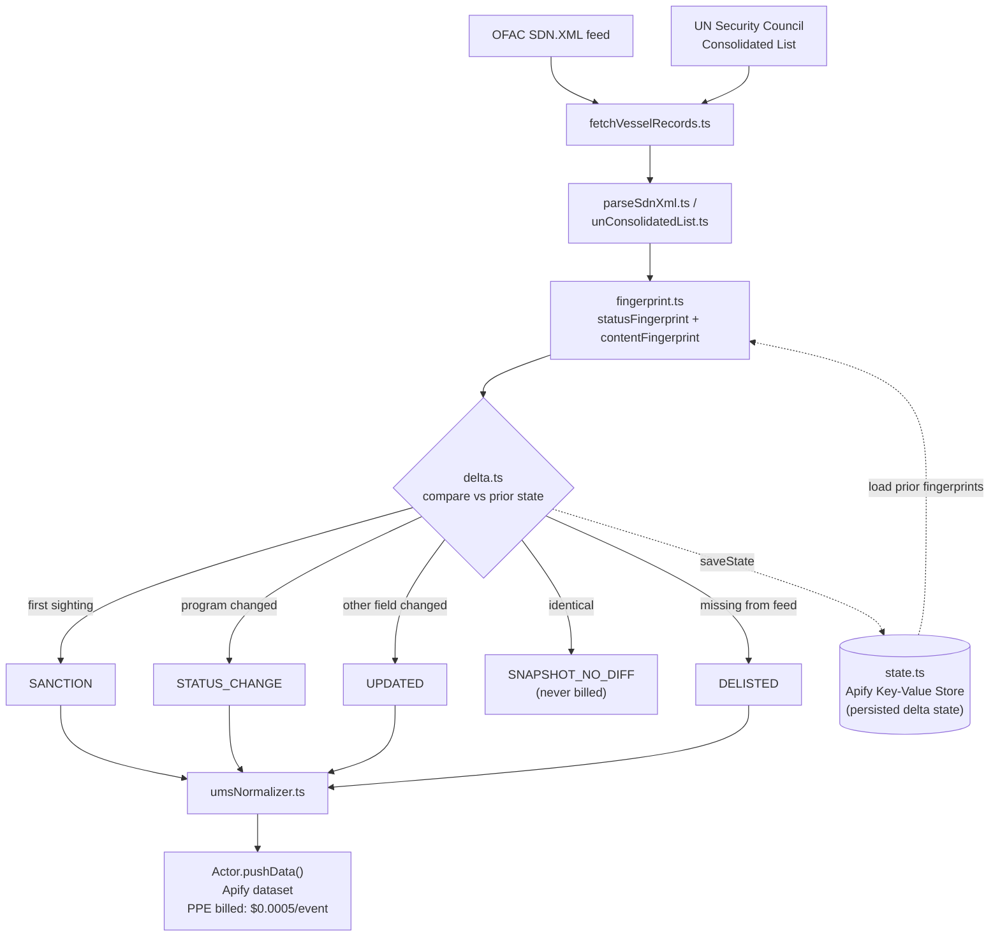

# Maritime Sanctions Watchdog - OFAC & UN Vessel Screening (Global Trade Compliance)

[](https://apify.com)
[](#cost--byok-disclosure)
[](https://www.typescriptlang.org/)
[](./LICENSE)

[](https://apify.com/stefano_seggio/actor-19-maritime-sanctions-monitor)

> This Actor monitors the US Treasury OFAC SDN vessel sanctions list cross-referenced against the UN Security Council Consolidated List (Global — OFAC / UN jurisdiction, by IMO number), and runs whenever you trigger it or schedule it on your own Apify Scheduler — there is no fixed operator-side cadence.

## Architecture

This diagram reflects the actual real module call graph in [`src/`](./src) — every node names the real file that implements it, not an illustrative simplification.



## Executive Value Proposition

The US Treasury's OFAC Specially Designated Nationals (SDN) list runs to roughly 19,000 entries in a single raw XML feed, of which about 1,540 are vessel-type designations - and the UN Security Council Consolidated Sanctions List carries no dedicated vessel record at all, only free-text IMO mentions buried in individual/entity remarks. Manually pulling both feeds, filtering to vessels, and cross-checking IMO numbers by eye is slow, easy to get wrong, and impractical to repeat on a schedule. This Actor automates that entire lookup - one run turns two raw government/UN feeds into one normalized, IMO-cross-referenced vessel dataset, and recurring runs add real change detection (new designations, sanctions-program changes, and delistings) instead of a manual re-diff every time.

## Use Cases

- **Vendor and counterparty KYC screening.** Before onboarding a shipping counterparty, charterer, or logistics vendor, screen the vessels they operate against the current OFAC vessel-type SDN list and see immediately whether any carry independent UN corroboration via IMO number.
- **Shipping and logistics risk checks.** Freight forwarders, marine insurers, and charterers can use `vesselNameContains` to check one vessel of interest before booking cargo or binding coverage, or run `programFilter` (e.g. `["IRAN"]`, `["RUSSIA-EO14024"]`) to watch an entire sanctions program relevant to a trade lane.
- **Export-compliance due diligence monitoring.** Compliance teams running recurring screening programs can schedule this Actor with `onlyNew` enabled to get only what changed since the last run - new sanctions, program additions/removals, and delistings - instead of re-reviewing the full list every cycle.

## Cost & BYOK Disclosure

### Pricing (Pay-Per-Event)

This Actor is monetized with Apify's [Pay-Per-Event](https://docs.apify.com/platform/actors/running/actors-in-store#pricing-models) model: you pay only for data actually delivered to the dataset, not for platform compute time.

| Event name | Event title | What triggers it | Price |
|---|---|---|---|
| `result` | Sanctioned Vessel Record | Every dataset item pushed - a `SANCTION`, `STATUS_CHANGE`, `UPDATED`, or `DELISTED` record | **$0.0005** per event |

Both source feeds (OFAC's SDN.XML and the UN Consolidated List) are plain unauthenticated file downloads with no per-record request cost, so there's no proxy or per-page fetch overhead passed through in the price.

### How unchanged-record suppression actually works

Each vessel gets two SHA-1 fingerprints, computed by [`src/fingerprint.ts`](./src/fingerprint.ts): a `statusFingerprint` over its sorted sanctions-program list, and a `contentFingerprint` over its other mutable fields (name, remarks, identifiers, flag, tonnage, owner). Comparing these against the previous run's persisted fingerprint classifies every vessel as `SANCTION` (first sighting), `STATUS_CHANGE` (program fingerprint changed), `UPDATED` (content fingerprint changed), or `SNAPSHOT_NO_DIFF` (identical to last time).

What actually gets billed depends on the `onlyNew` input:

- **`onlyNew: true` (recommended for recurring monitoring):** a `SNAPSHOT_NO_DIFF` vessel is skipped before it is ever pushed to the dataset - no `result` event fires, so it is genuinely **$0.00**, not billed, and not a refund applied after the fact.
- **`onlyNew: false` (the default, for a full point-in-time census):** every vessel currently on the OFAC vessel-type list is pushed, including unchanged ones marked `SNAPSHOT_NO_DIFF` - each still fires one `result` event at $0.0005, because you explicitly asked for the complete current list rather than only what changed.

A previously-seen vessel absent from the current OFAC feed is always reported `DELISTED` (and billed) regardless of `onlyNew`, unless the run was truncated by `maxItems`, in which case `DELISTED` detection is skipped for that run entirely rather than guessed at.

### BYOK (Bring Your Own Key)

This Actor requires no third-party API key. Both source feeds - OFAC's SDN.XML and the UN Security Council Consolidated List - are open, unauthenticated government/UN downloads with no login, API key, or paid tier of any kind.

## Quickstart

The Actor's real slug is `stefano_seggio/actor-19-maritime-sanctions-monitor` (Actor ID `dR68wHyuOLS2WEhmo`, works interchangeably in all three clients below).

### cURL (instant, synchronous)

Runs synchronously and returns the resulting dataset items directly in the response - no polling needed. Get your token from [console.apify.com/settings/integrations](https://console.apify.com/settings/integrations).

```bash
curl -X POST "https://api.apify.com/v2/acts/dR68wHyuOLS2WEhmo/run-sync-get-dataset-items?token=<YOUR_API_TOKEN>" \
  -H "Content-Type: application/json" \
  -d '{
  "maxItems": 50,
  "onlyNew": true
}'
```

### Python (`apify-client`)

```python
import os
from apify_client import ApifyClient

client = ApifyClient(token=os.environ["APIFY_TOKEN"])

run_input = {
    "maxItems": 100,
    "onlyNew": True,
    "enrichWithUnConsolidatedList": True,
    "programFilter": ["IRAN", "RUSSIA-EO14024"],
}

run = client.actor("stefano_seggio/actor-19-maritime-sanctions-monitor").call(run_input=run_input)
items = client.dataset(run["defaultDatasetId"]).list_items().items

for item in items:
    imo = item.get("imoNumber") or "n/a"
    print(f"{item['vesselName']} (IMO {imo}) - {item['event_type']}")
```

A full runnable copy lives at [`examples/run_actor.py`](./examples/run_actor.py).

### Node.js (`apify-client`)

```javascript
import { ApifyClient } from 'apify-client';

const client = new ApifyClient({ token: process.env.APIFY_TOKEN });

const run = await client.actor('stefano_seggio/actor-19-maritime-sanctions-monitor').call({
    maxItems: 100,
    onlyNew: true,
    enrichWithUnConsolidatedList: true,
    programFilter: ['IRAN', 'RUSSIA-EO14024'],
});

const { items } = await client.dataset(run.defaultDatasetId).listItems();
for (const item of items) {
    console.log(`${item.vesselName} (IMO ${item.imoNumber ?? 'n/a'}) - ${item.event_type}`);
}
```

A full runnable copy (CommonJS) lives at [`examples/run-actor.js`](./examples/run-actor.js).

### Apify CLI

```bash
apify call actor-19-maritime-sanctions-monitor --input '{
  "maxItems": 100,
  "onlyNew": true,
  "enrichWithUnConsolidatedList": true,
  "programFilter": ["IRAN", "RUSSIA-EO14024"]
}'
```

## Input & Output Schema

### Input

| Field | Type | Default | Description |
|---|---|---|---|
| `maxItems` | integer | `250` | Hard cap on how many vessel-type SDN records to return this run, taken in the order OFAC lists them in the source feed. |
| `onlyNew` | boolean | `false` | Delta mode - persists a SHA-1 content fingerprint per vessel between runs and returns only records that are new or changed since the last run. Vessels no longer present in the current OFAC feed are always reported as `DELISTED` regardless of this setting (unless the run was truncated by `maxItems`). Recommended for recurring monitoring. |
| `enrichWithUnConsolidatedList` | boolean | `true` | Cross-references each vessel's IMO number against the UN Security Council Consolidated Sanctions List. Disable for a faster OFAC-only run. |
| `programFilter` | array of strings | - | Optional: only return vessels whose Program list contains at least one of these OFAC program codes (case-insensitive substring match, e.g. `"IRAN"`, `"DPRK2"`, `"RUSSIA-EO14024"`). Leave empty to return vessels from all programs. |
| `vesselNameContains` | string | - | Optional case-insensitive substring filter on the vessel's listed name, applied before `maxItems`. Useful for a narrow monitoring run against one vessel of interest. |

Full machine-readable definition: [`.actor/input_schema.json`](./.actor/input_schema.json).

### Sample Extracted Dataset (JSON)

One real record from this Actor's own dataset, matching [`.actor/dataset_schema.json`](./.actor/dataset_schema.json):

```json
{
  "uid": "15036",
  "vesselName": "ARTAVIL",
  "programs": [
    "IRAN"
  ],
  "imoNumber": "9187629",
  "vesselFlag": "Iran",
  "crossReferencedInUnConsolidatedList": true,
  "record_id": "OFAC-SDN-15036",
  "event_type": "SANCTION",
  "scraped_at": "2026-09-08T14:00:00.000Z",
  "is_new": true,
  "source_url": "https://sanctionssearch.ofac.treas.gov/Details.aspx?id=15036"
}
```

Each dataset item also carries the vessel's other native OFAC fields (MMSI, other identifiers, call sign, vessel type, tonnage, owner, remarks, and AKA names) - omitted above only because they were empty for this particular vessel.

### Output field reference

| Field | Type | Description |
|---|---|---|
| `uid` | string | OFAC's own stable internal identifier for this SDN entry (the `<uid>` element / CSV `ent_num` column). Stable across list republications. |
| `vesselName` | string | The vessel's listed name. |
| `programs` | string[] | OFAC program code(s) this designation falls under, e.g. `IRAN`, `DPRK2`. |
| `imoNumber` | string \| null | 7-digit IMO ship identification number. Null when OFAC has not recorded one for this vessel - a real, documented gap, not every SDN vessel entry carries an IMO. |
| `vesselFlag` | string \| null | The vessel's flag state as listed by OFAC. |
| `crossReferencedInUnConsolidatedList` | boolean | `true` when this vessel's IMO number was also found in the UN Security Council Consolidated Sanctions List. Always `false` when `enrichWithUnConsolidatedList` was disabled, or when the vessel has no `imoNumber` to match on. |
| `record_id` | string | `OFAC-SDN-<uid>` - stable across runs. |
| `event_type` | string | One of `SANCTION` (first sighting), `STATUS_CHANGE` (sanctions program(s) changed), `UPDATED` (another tracked field changed), `SNAPSHOT_NO_DIFF` (identical to last time - only delivered when `onlyNew` is off), or `DELISTED` (no longer in the current OFAC feed). |
| `scraped_at` | string | ISO-8601 timestamp of this extraction. |
| `is_new` | boolean | `true` if this vessel was not seen in a prior run. |
| `source_url` | string | Per-vessel permalink on OFAC's own public Sanctions List Search tool. |

The full field list (including `unConsolidatedListMatches`, `otherIds`, `akaNames`, and the fleet-standard normalized envelope) is in [`.actor/dataset_schema.json`](./.actor/dataset_schema.json).

## Environment Variables

**None required.** This Actor takes zero third-party API keys or BYOK secrets - both source feeds (OFAC's SDN.XML and the UN Security Council Consolidated List) are open, unauthenticated downloads. The only environment variables present at runtime are the standard ones Apify's platform and SDK inject automatically into every Actor run (`APIFY_TOKEN`, `APIFY_ACTOR_ID`, `APIFY_DEFAULT_KEY_VALUE_STORE_ID`, etc.) - these are managed by the `apify` npm package and the Apify platform itself, never set manually by you or read directly by this Actor's own code.

## Operational Telemetry Limits

Real, measured values from this Actor's own production run history and current live platform configuration - not modeled or estimated:

| Metric | Value | Basis |
|---|---|---|
| Configured timeout (`defaultRunOptions.timeoutSecs`) | **300s** | Set from real telemetry (see below), not the Apify platform default of 3600s. |
| Configured memory (`defaultRunOptions.memoryMbytes`) | **2048 MB** | ~3.5x the real observed peak, rounded to the nearest Apify memory tier. |
| Real max observed runtime | **6.8s** (n=3 production runs) | Pulled from each run's own `stats.runTimeSecs` via the Apify API. |
| Real avg observed runtime | **6.5s** (n=3) | Same source. |
| Real peak memory used | **586 MB** (n=3) | From each run's own `stats.memMaxBytes`. |
| Effective safety margin | **~44x** | 300s timeout vs. 6.8s worst observed run. |
| Concurrency | Not configurable at the platform level | Apify's `defaultRunOptions` has no `concurrency` field - confirmed by inspecting the full Actor API resource. This Actor makes no internal concurrent-fetch parameter either (both source feeds are fetched sequentially, not paginated/fanned out). |

These figures were established via a fleet-wide real-telemetry audit (all 28 actors in the wider Delta Registry fleet), not set once at Actor creation and left unexamined - see this repository's own run history via `apify api get "acts/stefano_seggio~actor-19-maritime-sanctions-monitor/runs"` to reproduce.

## Reliability

- **Retrying HTTP layer.** Both source feeds are fetched with exponential-backoff retry (up to 4 retries, doubling from a 1-second base delay), with HTTP 429/503 explicitly treated as retryable alongside network failures and other non-2xx statuses. Both OFAC and UN endpoints redirect (302) to a pre-signed storage URL before returning the actual file; the client follows redirects by default.
- **A delta-state failure never blocks a fresh extraction.** Loading the persisted cross-run fingerprint state is a real network call to the Apify platform's key-value store and is treated as fallible: if it fails, the run logs the error and falls back to a cold-start (empty) delta state rather than crashing before a single record is fetched.
- **Extraction success is decoupled from state-persistence success.** If saving the updated delta state fails after a run's records were already pushed, that failure is logged on its own and does not retroactively mark an already-successful extraction as failed, and does not push a spurious error record on top of real data already in the dataset.
- **Process-level safety net.** Top-level `unhandledRejection`/`uncaughtException` handlers guarantee any failure outside the main try/catch blocks is written to the captured log stream before the process exits, rather than exiting silently.
- **Truncation-aware delisting logic.** The OFAC feed is always fetched and parsed in full - never paginated - so a previously-seen vessel that's genuinely absent is a trustworthy `DELISTED` signal, not a guess. If `maxItems` caps delivery before the full feed is walked, `DELISTED` detection is skipped for that run (and logged) and the vessel-fingerprint state is merged rather than replaced, so vessels beyond the cutoff are never wrongly reported as delisted next run.
- **Scoped UN cross-referencing.** IMO numbers are matched against the UN Consolidated List per-record (within each entity/individual's own remarks field), not via a flat whole-document scan, avoiding misattributing an IMO number to the wrong neighboring entity.
- **Source integrity.** Paris MoU/EMSA THETIS, Tokyo MoU/APCIS, and IMO GISIS were live-checked as candidate sources and excluded because they sit behind a login wall, a CAPTCHA-protected search form, or a robots.txt-restricted, registration-gated module, respectively. Only the two genuinely open, unauthenticated OFAC and UN feeds are used - no CAPTCHA-solving, login-wall bypass, or session spoofing anywhere in this Actor.

## Contributing & Local Setup

This repository ships the Actor's real, buildable TypeScript source (`src/`, `package.json`, `test/`) - local development against real logic is fully possible here:

```bash
git clone https://github.com/stefanoseggio/actor-19-maritime-sanctions-monitor.git
cd actor-19-maritime-sanctions-monitor
npm install
apify login              # once per machine
apify run                 # full local Actor run via the Apify CLI, reads ./storage/key_value_stores/default/INPUT.json
npm test                  # vitest run
```

No third-party credentials are required to run this Actor locally - both source feeds are open and unauthenticated.

Bugs, source-coverage requests (e.g. a new sanctions list to cross-reference), or proposed schema extensions are welcome via GitHub issues/PRs on this repository, or through the Apify Store's Issues tab on the [live Actor page](https://apify.com/stefano_seggio/actor-19-maritime-sanctions-monitor) for non-code questions. New sources are evaluated against the same compliance doctrine used to build this Actor - no CAPTCHA-solving, no login-wall bypass.

## Support & Enterprise SLA

This Actor is built and maintained by an independent developer, not a formal enterprise vendor - there is no contractual SLA. Issues, bugs, and source-coverage requests are handled through the Apify Store's Issues tab and are typically triaged within 48 hours. If you need a new data source evaluated or a schema extension, open an issue there with details and it will be reviewed against the same compliance doctrine (no CAPTCHA-solving, no login-wall bypass) used to build the rest of this Actor.

---

This Actor is part of **Delta Registry** - pay-per-event regulatory & compliance data infrastructure built and operated by Stefano Seggio. For professional inquiries or enterprise licensing, connect on [LinkedIn](https://www.linkedin.com/in/stefanoseggio-deltaregistry); for the rest of the fleet, see [github.com/stefanoseggio](https://github.com/stefanoseggio).
